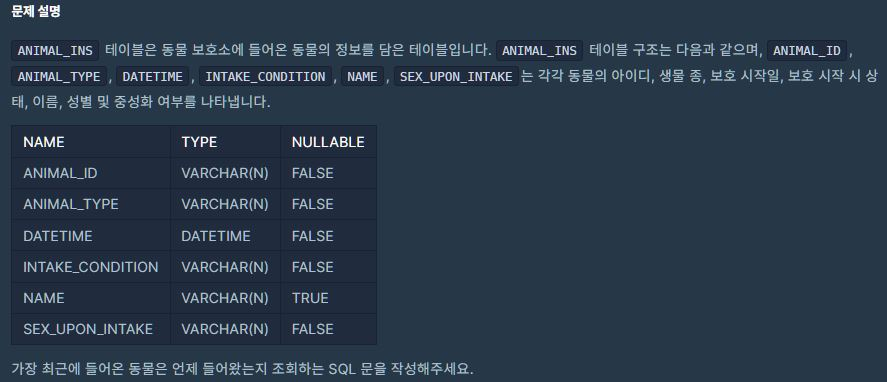
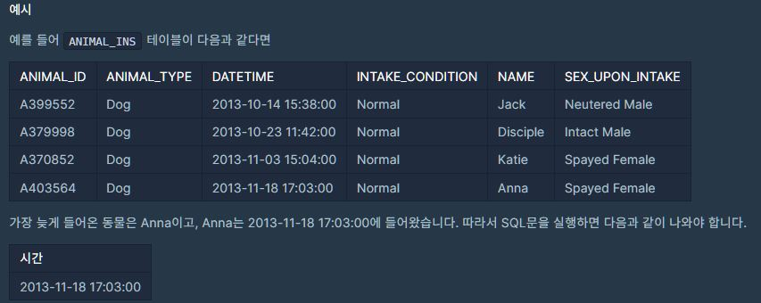
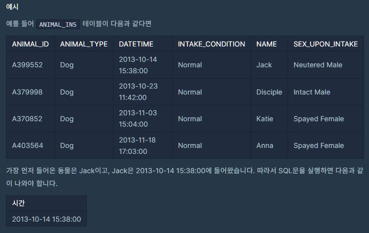
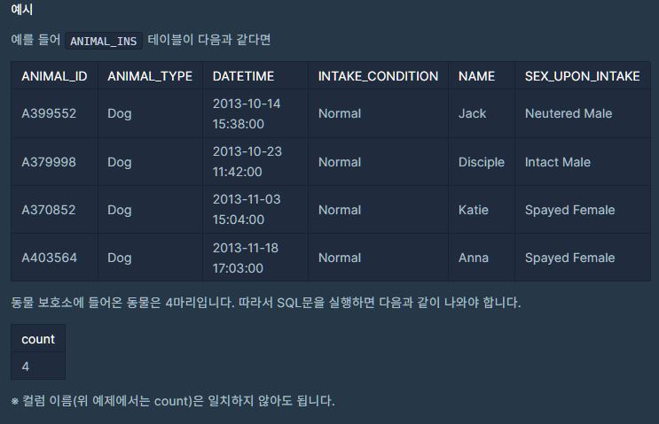
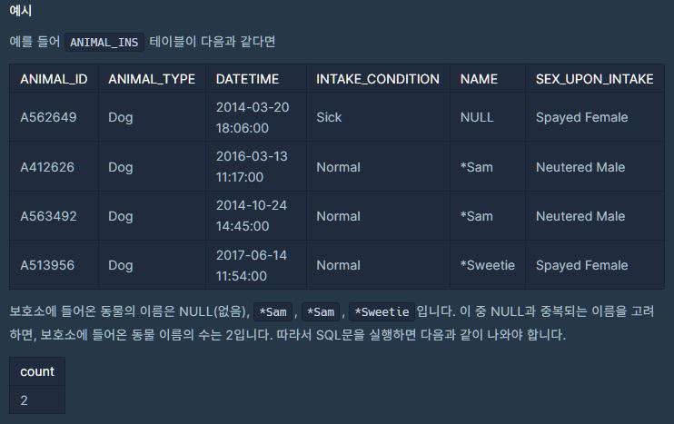

Sql공부를 소홀히 한거 같아 프로그래머스에 있는 
<a href="https://programmers.co.kr/learn/challenges?tab=sql_practice_kit">
SQL 고득점 Kit</a> 를 풀어 보았다.

# 테이블 설명


<br/>
<br/>

# 1. 최댓값 구하기


```SQL
SELECT MAX(DATETIME) as 시간 
from ANIMAL_INS 
```

MAX 함수 사용
as생략해서 별칭써도 됨
<br/><br/>

# 2. 최솟값 구하기


```SQL
SELECT MIN(DATETIME) AS 시간
FROM ANIMAL_INS
```

MIN 함수 사용
<br/><br/>

# 3. 동물 수 구하기

> 동물 보호소에 들어온 동물 중 아픈 동물의 아이디와 이름을 조회하는 SQL 문을 작성해주세요.

```SQL
SELECT COUNT(ANIMAL_TYPE) 
FROM ANIMAL_INS
```
COUNT 함수 사용
 
<br/><br/>

# 4. 중복 제거하기

```SQL
SELECT COUNT (DISTINCT(NAME))
FROM ANIMAL_INS
WHERE NAME IS NOT NULL
```
원하는 속성만 제외 시키는 방법 WHERE COLUMN명 NOT IN ('조건1','조건2','조건3')

<br/><br/>
